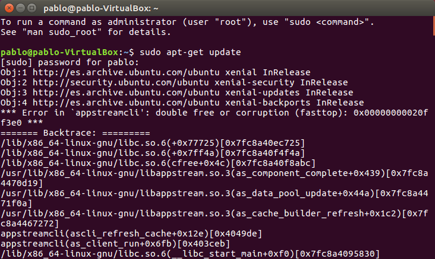
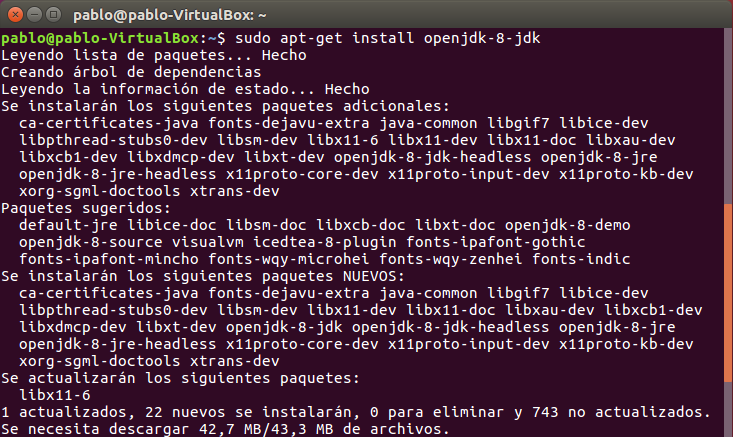

# Instalación de JDK en el SO
## Indice
- **[1. Instalación](#instalación)**
- **[2. Variables de entorno](#variables-de-entorno)**
### Instalación
Para esta práctica necesitaremos una máquina con el sistema operativo ubuntu, pudiendo usarse también xubuntu. Necesitaremos usar únicamente el terminal de ubuntu, y para empezar usaremos el siguiente comando que nos servirá para actualizar el sistema: **“sudo apt-get update”**. 

Tras haber actualizado el sistema ya comenzaremos a instalar Java, para realizar esto deberemos usar el siguiente comando: **“sudo apt-get install default-jdk”**.

A modo de comprobación podremos usar el comando version para saber la versión de java que se ha instalado: **“java -version”**.

Tras haber realizado la instalación de Java seguiremos con la instalación de Ubuntu Java Open JDK, en este comando podemos elegir la versión que desees instalar. El comando en concreto es el siguiente: **“sudo apt install openjdk-8-jdk”**.

Cuando se termine de instalar miraremos qué versión de java tenemos, necesitaremos tener la versión 8, para saber esto usaremos el siguiente comando: **“java -version”**.

### Variables de entorno

En el caso que, al usar el comando **“java -version”**, aparezca que no tienes la versión 8 tendremos que modificar lo siguiente. Tendremos que usar el siguiente comando para editar el siguiente directorio: **“sudo nano /etc/profile”**. Y aquí debemos poner lo siguiente:

Tras esto lo comprobaremos con el comando: **“java -version”**.
